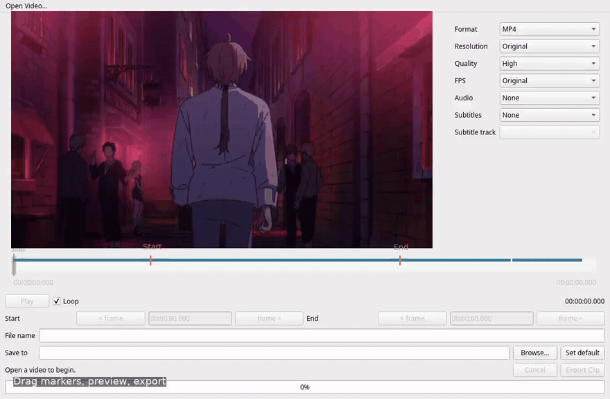

# mpv Clipper

A native, mouse-first Qt 6 companion for clipping one range from a local video.
The V1 implementation includes an embedded libmpv preview, draggable range,
frame stepping, audio/subtitle selection, and FFmpeg export to MP4, MKV, WebM,
and GIF. Multi Clip mode adds independent clip configurations and batch export.



## Easy installation (release packages)

Portable release packaging is provided for Linux x86-64, Windows x86-64, and
macOS Apple Silicon/Intel. Native builds are prepared by GitHub Actions; these
platforms are not release-certified until their builds and acceptance checks pass.

With a verified release package, install mpv with Lua support, extract the package
into a permanent folder, and run:

| Platform | Setup | Removal |
| --- | --- | --- |
| Linux | `sh install.sh` | `sh uninstall.sh` |
| Windows | Double-click `install.cmd` | Double-click `uninstall.cmd` |
| macOS | Double-click `install.command` | Double-click `uninstall.command` |

Restart mpv and press **Ctrl+Shift+X** while playing a local video. Clipper starts
on demand. Packages include Qt, libmpv, FFmpeg and ffprobe; no Conda or compiler is
needed. Linux setup extracts its AppImage once, so FUSE is not required. Keep the
package folder in place after setup. Use the package matching your architecture.

Setup backs up existing `clipper.lua` and `clipper.conf`, preserves a configured
hotkey, and leaves `input.conf`/`mpv.conf` alone. Removal restores those backups;
it refuses to overwrite later manual edits. Custom mpv configurations can be
selected with `--mpv-config "/path/to/config"` on both setup and removal scripts.
Windows defaults to `%APPDATA%\\mpv`, or `portable_config` beside an mpv on PATH;
Unix defaults to `$XDG_CONFIG_HOME/mpv` or `~/.config/mpv`.

See [release packaging](packaging/RELEASE.md) for system requirements, unsigned
build limitations, upgrade instructions, and remaining native verification.

See [verification status](plan/IMPLEMENTATION_STATUS.md) for completed checks
and the remaining release acceptance work. This is not yet a release-certified build.

## Build in Conda

```sh
conda env create -f environment.yml
conda activate mpv-clipper
cmake -S . -B build -G Ninja -DCMAKE_BUILD_TYPE=Debug
cmake --build build -j 2
./build/mpv-clipper
```

Requires C++20, CMake 3.22+, Qt 6.4+ (Core, Gui, Widgets, Network,
Concurrent, OpenGL, OpenGLWidgets), libmpv, FFmpeg, and ffprobe. Qt Test is used
only when `BUILD_TESTING=ON` (the default). The Conda environment includes all
build/runtime dependencies; system mpv with Lua is needed for the hotkey bridge.

Conda-forge's current mpv package lacks Lua support. Configure the bridge test
against the system mpv, without changing the libmpv used by the application:

```sh
cmake -S . -B build -DMPV_EXECUTABLE=/usr/bin/mpv
ctest --test-dir build --output-on-failure
```

Tests include real exports with generated media, subtitle overlap timing,
Unicode/apostrophe paths, cancellation, and libmpv frame stepping. The IPC test
needs permission to create a local Unix socket. `ui_smoke` needs a desktop or
Xvfb and is explicitly skipped when neither DISPLAY nor WAYLAND_DISPLAY is set.
To exercise it with a virtual display installed:

```sh
LIBGL_ALWAYS_SOFTWARE=1 QT_QPA_PLATFORM=xcb xvfb-run -a ctest --test-dir build --output-on-failure
```

## Build with system packages (Ubuntu 24.04)

```sh
sudo apt-get install build-essential cmake ninja-build pkg-config qt6-base-dev libqt6opengl6-dev libmpv-dev mpv ffmpeg
cmake -S . -B build-system -G Ninja -DCMAKE_BUILD_TYPE=Release
cmake --build build-system -j 2
ctest --test-dir build-system --output-on-failure
```

Run these commands outside Conda to produce a system-linked build.

## Launch from mpv

Copy `mpv/clipper.lua` to `~/.config/mpv/scripts/clipper.lua` and
`mpv/clipper.conf.example` to `~/.config/mpv/script-opts/clipper.conf`.
Set `executable` to the absolute path of the built application. For a Conda
build, launch the system player from the activated environment:

```sh
conda activate mpv-clipper
/usr/bin/mpv '/path/to/video.mkv'
```

Press **Ctrl+Shift+X** to open the current source and timestamp. The bridge pauses
mpv and restores its previous state when the editor closes. Repeating the hotkey
focuses the existing window. A launch from another mpv process forwards its
payload and uses `--wait-for-close` to retain pause ownership until the primary
window closes. Ordinary secondary invocations forward their payload and exit.
Opening a different source is refused during export, probing, or a frame step.

The bridge sends launch JSON through subprocess stdin on all three platforms.
Subprocess arguments are passed as arrays; filenames are never shell commands.
No temporary file or shell utility is needed. Legacy `--launch-payload` files
remain supported for existing installations and development tools.

Development launch options:

```sh
./build/mpv-clipper --source '/path/to/video.mkv' --time 754.233
./build/mpv-clipper --launch-payload '/tmp/mpv-clipper-example.json'
```

`--time` requires `--source` and accepts finite, non-negative seconds.
`--source` and `--launch-payload` are mutually exclusive. With no source, use
**Open Video...** in the window.

## Editing and exporting

- The initial selection is the full video; preview starts paused at launch time.
- Drag Start/End or edit their timestamps. During dragging, preview seeks are
  coalesced and use nearby keyframes for responsiveness; releasing always requests
  an exact seek. The selected timestamps and export accuracy are unchanged.
  Frame buttons use decoded mpv frame
  positions, including variable cadence, rather than adding a nominal frame duration.
- Roll the wheel over the timeline to zoom in/out around the pointer (no Ctrl), in gentle 10% steps.
- Click a Start or End marker to select it (outlined in white). Both frame buttons
  move the selected marker; click elsewhere on the timeline to clear selection
  and step the current playback position instead.
  **Zoom to Clip** fits the active clip with context; **Fit Video** restores the
  full source. The small overview below the timeline pans the visible section
  without seeking or changing the clip. Zoom can show as little as 0.1 seconds.
- Play previews the selection. Loop is on by default. Boundary edits pause playback.
- Choose one audio track or None. Hardsub renders text subtitles into video;
  Softsub retains a selectable track where the container supports it.
- GIF has separate width/FPS/quality settings and no audio or Softsub.
- Automatic filenames follow the range until manually edited. Format changes
  still update the extension. Browse chooses a folder; Set default remembers it.
- Export runs asynchronously. Cancel removes the private partial file. Existing
  destinations are replaced only after confirmation and a successful export.
- Open File, Open Folder, and Copy Path appear when export succeeds.

Text subtitle support covers internal/external ASS, SSA, SRT, WebVTT, and common
text tracks. Bitmap subtitles are disabled for export. Softsub conversion to
MP4/WebM loses ASS styling. Clipped text events are rebased and bounded to the
selected range; use Hardsub when preserving animated ASS/karaoke appearance at
a cut matters. Font rendering uses libass and available fonts/attachments, with
fallback fonts when necessary.

Video presets preserve aspect ratio, avoid preset upscaling, and use even
encoder dimensions. Custom dimensions can be unlocked. Export settings do not
re-encode the live preview. FFmpeg feature detection disables unavailable formats.
Late clips use a fast input seek with a short decoding preroll, followed by exact
video/audio trimming. Source-relative timestamps preserve subtitle timing, including
animated hardsubs. Encoding quality is unchanged; high-resolution video, subtitle
preparation, and slower codecs can still take time.

## Multiple clips

Choose **Multi Clip** at the top of the editor. The current selection becomes the
first clip. **Add Clip** copies its current range and settings into an independent
clip; adjust the new range and settings as needed. Overlapping ranges are allowed.

Select a clip in the list to restore its own range, loop preference, format,
resolution, quality, FPS, GIF settings, audio, subtitles, filename, and folder.
Inactive ranges are shown faintly on the timeline; click one outside the active
range to select it. Use the list for overlapping ranges. **Delete Clip** removes
only the selected clip; at least one remains. Single Clip remains the default.

**Export All** validates every output, rejects duplicate destinations, asks before
replacing existing files, and exports clips sequentially. Mixed formats and
folders work in the same batch. Each row shows its status and progress; hover for
its output path or failure details. **Cancel Current** continues with the next
clip, **Cancel All** stops the queue, and **Retry Failed** retries failed clips.
Double-click a completed clip to open its file. Editing is locked during a batch.
Clips remain in memory for the current source; closing the editor or opening a new
source clears them. Sequence preview and joining clips are not implemented.

## Install and package

```sh
cmake --install build --prefix "$HOME/.local"
cd build
cpack -G TGZ
```

The install tree contains the application, desktop entry, Lua script, and example
script configuration. Copy the script/config into your mpv configuration as
described above. The tar archive is not a self-contained AppImage: Qt, libmpv,
FFmpeg and ffprobe must be installed. A Conda-linked package depends on its Conda
environment; use the system build for distribution to matching Linux systems.
The project is licensed under **GPL-3.0-or-later**; see [LICENSE](LICENSE).
Bundled dependencies retain their own licenses and source-distribution requirements.

Window geometry and output preferences are stored with Qt QSettings. No media
session is persisted. See [the original plan](plan/README.md) for the full scope.

## Interface theme

The native Qt Widgets interface uses a Plum theme: header mode selection,
a compact batch queue above the export settings, format buttons, paired settings,
and a styled playback strip and export dock. The Qt-compatible stylesheet and
icons live in `assets/` and are embedded in the executable; no browser, React,
QML runtime, or external stylesheet installation is required.
